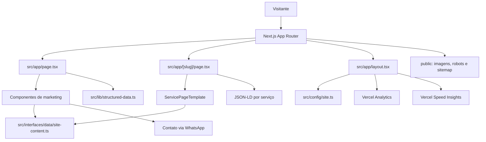
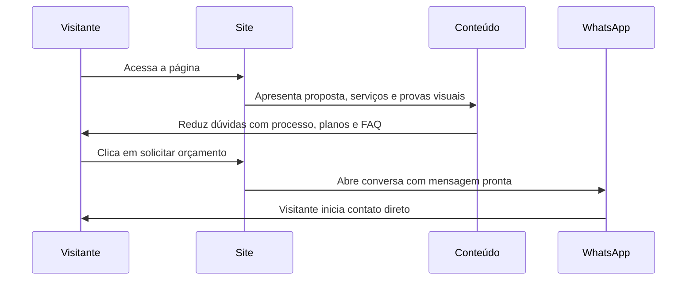
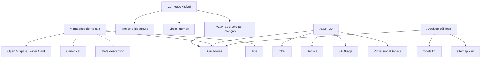
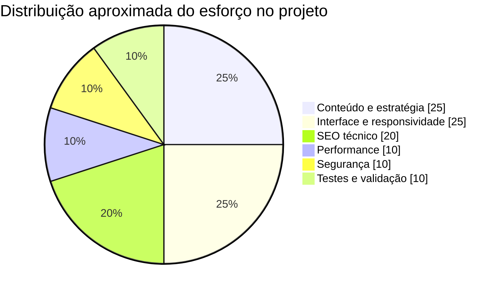
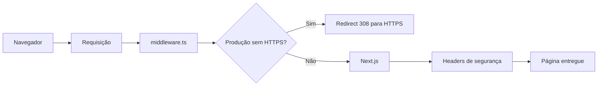
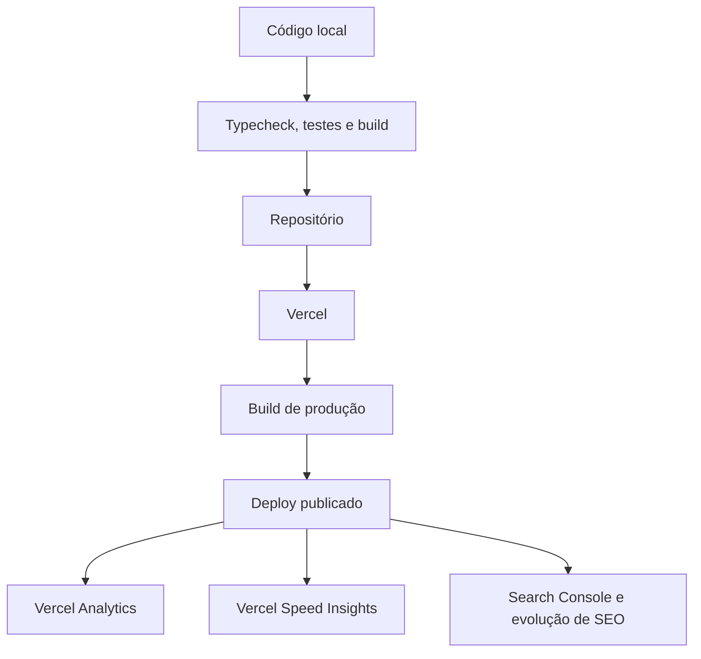
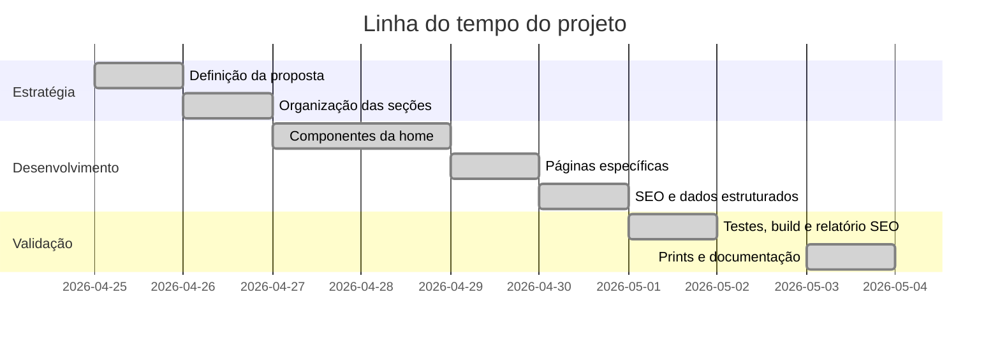

O Ismael Dev Studio nasceu com um objetivo prático: criar uma presença digital profissional para apresentar serviços de criação de sites, landing pages, portfólios digitais e soluções com IA, com foco em gerar contatos reais pelo WhatsApp.

Neste artigo, mostro o processo completo de construção do projeto: planejamento, stack, organização do código, criação da interface, SEO, dados estruturados, segurança, testes, prints, diagramas, gráficos e deploy.

## Sumário

- [Resultado final em prints](#resultado-final-em-prints)
- [Objetivo do projeto](#objetivo-do-projeto)
- [Ferramentas utilizadas](#ferramentas-utilizadas)
- [Arquitetura geral](#arquitetura-geral)
- [Processo de construção](#processo-de-construcao)
- [Interface e experiência do usuário](#interface-e-experiencia-do-usuario)
- [SEO técnico e conteúdo orgânico](#seo-tecnico-e-conteudo-organico)
- [Performance, segurança e confiabilidade](#performance-seguranca-e-confiabilidade)
- [Testes e validação](#testes-e-validacao)
- [Deploy e monitoramento](#deploy-e-monitoramento)
- [Aprendizados](#aprendizados)

## Resultado final em prints

Antes de entrar no processo técnico, vale visualizar o resultado.

### Home em desktop

<figure class="article-figure is-wide">
  
  <figcaption>Home em desktop com proposta de valor, CTA principal e foco em conversão via WhatsApp.</figcaption>
</figure>

O primeiro bloco da home comunica rapidamente a proposta: criação de sites profissionais com contato direto pelo WhatsApp. A página já apresenta público-alvo, benefícios principais, chamada para orçamento e visual demonstrativo.

### Home em mobile

<figure class="article-figure is-wide">
  
  <figcaption>Versão mobile pensada para leitura rápida e contato direto em telas menores.</figcaption>
</figure>

No celular, a prioridade foi manter a leitura rápida e os botões principais acessíveis. Como muitos visitantes chegam por redes sociais, bio, indicação ou WhatsApp, a experiência mobile precisava ser tratada como parte central do projeto.

### Página específica para restaurantes

<figure class="article-figure">
  
  <figcaption>Página de serviço criada para trabalhar uma intenção de busca específica e aumentar a cobertura orgânica.</figcaption>
</figure>

Além da home, o projeto tem páginas específicas para buscas mais direcionadas. A página de restaurantes trabalha uma intenção de busca própria: restaurantes, pizzarias e negócios de alimentação que querem receber pedidos pelo WhatsApp.

## Objetivo do projeto

O projeto não foi pensado apenas como um portfólio visual. A intenção era construir uma vitrine comercial com clareza, performance e estrutura para crescimento orgânico.

Os objetivos principais foram:

- apresentar o serviço de criação de sites de forma direta;
- mostrar exemplos de projetos possíveis;
- explicar o processo de trabalho;
- exibir planos com valores iniciais;
- reduzir dúvidas antes do contato;
- facilitar orçamento pelo WhatsApp;
- preparar a estrutura para SEO;
- publicar o site em uma plataforma confiável;
- acompanhar acesso e performance após o deploy.

A ideia central foi tratar o site como ferramenta de venda. Cada seção tem uma função: explicar, gerar confiança, antecipar dúvidas ou levar o visitante para a próxima ação.

## Ferramentas utilizadas

| Ferramenta | Papel no projeto | Onde aparece |
| --- | --- | --- |
| Next.js 14 | Base da aplicação, rotas, metadados e build | `src/app/` |
| React 18 | Componentização da interface | Componentes em `src/interfaces/components/` |
| TypeScript | Tipagem de conteúdo, props e configurações | Arquivos `.ts` e `.tsx` |
| Tailwind CSS | Layout, responsividade e estilo visual | Classes nos componentes |
| Lucide React | Ícones dos botões, cards e destaques | `lucide-react` |
| Vercel | Hospedagem, build e publicação | Deploy do site |
| Vercel Analytics | Monitoramento de visitas | `src/app/layout.tsx` |
| Vercel Speed Insights | Monitoramento de performance | `src/app/layout.tsx` |
| Vitest | Testes automatizados | `src/lib/structured-data.test.ts` |
| next/font/local | Fontes locais otimizadas | `src/app/layout.tsx` |
| JSON-LD | Dados estruturados para buscadores | `src/lib/structured-data.ts` |
| WebP | Imagens mais leves | `public/*.webp` |
| Chrome Headless | Captura dos prints do artigo | `docs/assets/*.png` |

## Stack escolhida

A stack foi escolhida para equilibrar qualidade técnica, velocidade de desenvolvimento e facilidade de publicação.

| Camada | Escolha | Motivo |
| --- | --- | --- |
| Framework | Next.js | Bom suporte a SEO, metadados, rotas estáticas e deploy na Vercel |
| UI | React | Componentização clara e reaproveitável |
| Linguagem | TypeScript | Mais segurança para evoluir conteúdo e tipos |
| Estilo | Tailwind CSS | Agilidade visual sem criar CSS solto demais |
| Ícones | Lucide React | Biblioteca consistente, leve e fácil de usar |
| Testes | Vitest | Rápido para validar funções e estruturas |
| Deploy | Vercel | Integração natural com Next.js |
| Monitoramento | Analytics e Speed Insights | Dados de acesso e performance pós-publicação |

## Arquitetura geral

A organização do projeto foi pensada para separar conteúdo, configuração, componentes e regras técnicas.

```text
src/
  app/
    layout.tsx
    page.tsx
    [slug]/page.tsx
    globals.css
    fonts/
  config/
    site.ts
  interfaces/
    components/
      marketing/
    data/
      site-content.ts
    types/
      site.ts
  lib/
    structured-data.ts
    structured-data.test.ts
public/
  robots.txt
  sitemap.xml
  *.webp
docs/
  ARTIGO_COMO_CONSTRUI_O_ISMAEL_DEV_STUDIO.md
  SEO_ANALISE.md
  assets/
```

O conteúdo principal fica centralizado em `src/interfaces/data/site-content.ts`. Essa decisão evita espalhar textos de serviços, projetos, planos e FAQ por vários componentes.

As configurações gerais ficam em `src/config/site.ts`, incluindo:

- título do site;
- descrição SEO;
- palavras-chave;
- URL pública;
- WhatsApp;
- GitHub;
- LinkedIn;
- URL da imagem social.

Os componentes de marketing ficam em `src/interfaces/components/marketing/`. Assim, cada parte da home tem responsabilidade própria: header, hero, serviços, projetos, processo, SEO estratégico, planos, CTA final, rodapé e botão flutuante de WhatsApp.

### Diagrama da arquitetura



## Processo de construção

O desenvolvimento foi dividido em etapas para evitar criar apenas uma página bonita sem estratégia por trás.

### 1. Definição da proposta

Antes do código, defini a mensagem principal:

```text
Sites profissionais, landing pages e portfólios para pequenos negócios,
autônomos e profissionais que querem receber contatos pelo WhatsApp.
```

Essa proposta orientou o restante do projeto. O site precisava responder rapidamente:

- quem é o serviço para;
- qual problema resolve;
- quais entregas estão disponíveis;
- quanto custa para começar;
- como falar com o desenvolvedor.

### 2. Estrutura comercial da home

A home foi organizada como uma página de conversão, não como uma página institucional genérica.

Fluxo da página:

```mermaid
flowchart LR
  Hero[Proposta principal] --> Servicos[Serviços]
  Servicos --> Projetos[Projetos demonstrativos]
  Projetos --> Processo[Processo de trabalho]
  Processo --> SEO[Bloco de SEO estratégico]
  SEO --> Planos[Planos e valores iniciais]
  Planos --> Sobre[Sobre e confiança]
  Sobre --> FAQ[FAQ]
  FAQ --> CTA[Chamada final]
  CTA --> WhatsApp[Contato pelo WhatsApp]
```



Cada bloco responde uma etapa da decisão do visitante. O hero chama atenção, os serviços explicam a oferta, os projetos mostram exemplos, os planos qualificam o cliente e o FAQ reduz dúvidas antes do clique.

### 3. Modelagem do conteúdo

Em vez de colocar textos diretamente nos componentes, o conteúdo foi organizado em objetos tipados.

Exemplos de blocos centralizados:

- `navigationItems`;
- `services`;
- `projects`;
- `steps`;
- `plans`;
- `benefits`;
- `faqs`;
- `servicePages`.

Essa organização torna o projeto mais fácil de evoluir. Para adicionar um novo serviço ou mudar a descrição de um plano, basta alterar o arquivo de dados, mantendo os componentes mais limpos.

### 4. Criação dos componentes

A interface foi quebrada em componentes menores:

| Componente | Função |
| --- | --- |
| `Header` | Navegação principal e CTA de orçamento |
| `Hero` | Proposta de valor, público-alvo, benefícios e chamada principal |
| `Services` | Lista de serviços oferecidos |
| `Projects` | Exemplos de projetos demonstrativos |
| `Process` | Etapas do atendimento |
| `StrategicSeo` | Explicação da estrutura de SEO |
| `AboutAndPlans` | Sobre, diferenciais e planos |
| `FinalCTA` | Chamada final para contato |
| `Footer` | Links, informações e navegação |
| `WhatsAppFloat` | Botão flutuante de contato |
| `ServicePageTemplate` | Modelo das páginas específicas por serviço |

### 5. Construção visual e responsiva

A interface foi criada com Tailwind CSS. A escolha ajudou a trabalhar responsividade diretamente nos componentes, com classes como:

```text
grid
gap-10
px-5
sm:py-16
lg:grid-cols-[1.05fr_0.95fr]
lg:px-8
```

O cuidado principal foi garantir que a página funcionasse bem em desktop e mobile. No desktop, existe espaço para apresentar imagem, proposta e benefícios lado a lado. No mobile, a hierarquia muda para priorizar leitura e ação.

### 6. Criação das páginas específicas

Além da home, foram criadas páginas para intenções de busca mais específicas:

| Rota | Palavra-chave foco |
| --- | --- |
| `/criacao-de-sites-profissionais` | criação de sites profissionais |
| `/landing-page-para-pequenos-negocios` | landing page para pequenos negócios |
| `/site-para-autonomos` | site para autônomos |
| `/site-para-restaurantes` | site para restaurantes |
| `/portfolio-digital` | portfólio digital |

Essas páginas usam `src/app/[slug]/page.tsx` e os dados de `servicePages`. O Next.js gera as rotas com `generateStaticParams`, e cada página recebe metadados próprios com `generateMetadata`.

### 7. Integração com WhatsApp

O WhatsApp foi tratado como o principal canal de conversão. A URL é montada em `src/config/site.ts`:

```text
https://wa.me/5514991920560?text=...
```

A mensagem já vem pré-preenchida para facilitar a conversa. Isso reduz atrito: o visitante não precisa copiar número, procurar contato ou pensar no que escrever.

### Diagrama do fluxo de conversão



## Interface e experiência do usuário

A experiência foi desenhada para ser direta. O visitante não deve precisar interpretar a página. Ele precisa entender rapidamente a oferta e saber onde clicar.

### Decisões de UX

| Decisão | Motivo |
| --- | --- |
| CTA no header | Facilita contato sem depender de rolagem |
| Hero com frase objetiva | Explica a proposta em poucos segundos |
| Benefícios curtos | Ajuda a escanear valor rapidamente |
| Projetos demonstrativos | Dá referências visuais concretas |
| Planos com preço inicial | Qualifica o contato antes do orçamento |
| FAQ | Remove dúvidas comuns |
| WhatsApp flutuante | Mantém o canal de ação sempre acessível |

### Hierarquia visual

A hierarquia segue a ordem:

1. promessa principal;
2. público atendido;
3. chamada para orçamento;
4. benefícios rápidos;
5. serviços e exemplos;
6. processo e planos;
7. FAQ e CTA final.

Essa ordem evita começar pela tecnologia. O visitante não compra Next.js ou TypeScript. Ele procura presença profissional, confiança e contato com clientes.

## SEO técnico e conteúdo orgânico

SEO foi planejado desde o começo. O projeto inclui:

- `title`;
- `meta description`;
- `canonical`;
- Open Graph;
- Twitter Card;
- `robots.txt`;
- `sitemap.xml`;
- idioma `pt-BR`;
- imagens com texto alternativo;
- conteúdo organizado por intenção de busca;
- dados estruturados em JSON-LD.

### Dados estruturados

Os dados estruturados ficam em `src/lib/structured-data.ts`. A home gera schemas de:

- `ProfessionalService`;
- `WebSite`;
- `FAQPage`;
- `Offer` dentro do serviço profissional.

As páginas específicas geram:

- `Service`;
- `FAQPage`.

Isso ajuda mecanismos de busca a entenderem melhor o negócio, os serviços, planos, perguntas frequentes e dados de contato.

### Diagrama do SEO



### Gráfico de foco do esforço

Este gráfico representa uma divisão aproximada do esforço de construção. Não é uma métrica automática; é uma leitura prática do peso de cada frente no projeto.



### Pontos avaliados no relatório de SEO

O projeto também possui um relatório técnico em `docs/SEO_ANALISE.md`. A avaliação estimada foi:

| Área | Nota | Leitura |
| --- | --- | --- |
| SEO técnico | 8.5/10 | Base forte |
| Conteúdo e intenção de busca | 8/10 | Boa cobertura inicial |
| Dados estruturados | 8/10 | Estrutura forte |
| Performance e experiência | 8/10 | Boa base |
| Conversão | 8.5/10 | CTAs e WhatsApp bem integrados |
| Autoridade e crescimento orgânico | 5/10 | Ainda depende de domínio, conteúdo e links externos |

## Performance, segurança e confiabilidade

### Performance

As principais decisões de performance foram:

- uso de Next.js;
- imagens em WebP;
- fontes locais com `next/font/local`;
- `display: swap` nas fontes;
- componentes estáticos sempre que possível;
- integração com Vercel Speed Insights;
- CSS utilitário com Tailwind;
- redução de dependências visuais pesadas.

As fontes ficam em:

```text
src/app/fonts/
```

O carregamento é configurado em:

```text
src/app/layout.tsx
```

### Segurança

O projeto inclui headers configurados em `next.config.mjs`, como:

- `Content-Security-Policy`;
- `Strict-Transport-Security`;
- `X-Content-Type-Options`;
- `X-Frame-Options`;
- `Referrer-Policy`;
- `Permissions-Policy`;
- `Cross-Origin-Opener-Policy`;
- `Cross-Origin-Resource-Policy`.

Também existe um `middleware.ts` para redirecionar requisições de produção para HTTPS quando necessário.

Esses detalhes não aparecem visualmente na página, mas aumentam a confiabilidade técnica do projeto.

### Diagrama de segurança e publicação



## Testes e validação

O projeto inclui validações para reduzir risco antes do deploy.

Comandos principais:

```bash
npm run typecheck
npm test
npm run build
```

O papel de cada comando:

| Comando | O que valida |
| --- | --- |
| `npm run typecheck` | Tipagem TypeScript sem gerar arquivos |
| `npm test` | Testes automatizados com Vitest |
| `npm run build` | Build de produção do Next.js |

Os testes atuais validam principalmente os dados estruturados:

- schema `ProfessionalService`;
- schema `WebSite`;
- schema `FAQPage`;
- presença de ofertas;
- URL canônica;
- perguntas e respostas estruturadas.

Isso é importante porque JSON-LD costuma ser fácil de quebrar silenciosamente. Um campo removido ou mal montado pode não aparecer na interface, mas afetar SEO técnico.

## Como os prints foram gerados

Os prints usados neste artigo foram capturados com o site rodando localmente.

Servidor local:

```bash
npm run dev
```

Captura desktop:

```bash
google-chrome --headless=new --disable-gpu --hide-scrollbars \
  --window-size=1440,1100 \
  --screenshot=docs/assets/print-home-desktop.png \
  http://127.0.0.1:3000
```

Captura mobile:

```bash
google-chrome --headless=new --disable-gpu --hide-scrollbars \
  --window-size=390,1200 \
  --screenshot=docs/assets/print-home-mobile.png \
  http://127.0.0.1:3000
```

Captura da página de restaurantes:

```bash
google-chrome --headless=new --disable-gpu --hide-scrollbars \
  --window-size=1440,1100 \
  --screenshot=docs/assets/print-pagina-restaurante.png \
  http://127.0.0.1:3000/site-para-restaurantes
```

Esses prints ajudam a documentar o resultado real da interface, não apenas a intenção do projeto.

## Deploy e monitoramento

O deploy foi feito na Vercel, que combina bem com Next.js por simplificar build, publicação e monitoramento.

URL pública:

```text
https://ismaeldevstudio.vercel.app
```

### Pipeline do projeto



Após o deploy, as próximas frentes de monitoramento são:

- visitas no Vercel Analytics;
- performance no Vercel Speed Insights;
- indexação no Google Search Console;
- cliques e impressões por página;
- páginas com boa impressão e baixo CTR;
- oportunidades para novas páginas por nicho.

## Linha do tempo do desenvolvimento



As datas acima funcionam como registro documental do processo. O ponto principal é mostrar a sequência: estratégia primeiro, desenvolvimento depois, validação antes da publicação contínua.

## Aprendizados

Construir o Ismael Dev Studio reforçou uma ideia importante: um site profissional não depende só de visual. Ele precisa unir mensagem, estrutura, performance, SEO, confiança e conversão.

As decisões técnicas só fizeram sentido porque serviam a um objetivo comercial claro:

- Next.js para performance, rotas e SEO;
- TypeScript para segurança e manutenção;
- Tailwind CSS para agilidade visual;
- conteúdo centralizado para facilitar evolução;
- páginas específicas para crescimento orgânico;
- WhatsApp integrado para conversão direta;
- Vercel para deploy e monitoramento;
- testes para proteger partes sensíveis, como JSON-LD.

## Próximos passos

O projeto já tem uma base sólida, mas pode evoluir em frentes importantes:

- configurar um e-mail real em `NEXT_PUBLIC_CONTACT_EMAIL`;
- cadastrar o domínio no Google Search Console;
- enviar o sitemap;
- criar páginas para novos nichos, como lojas, advogados, psicólogos e prestadores locais;
- adicionar depoimentos e provas sociais reais;
- criar estudos de caso com problema, solução e resultado;
- acompanhar dados de acesso para melhorar conteúdo e CTAs.

## Conclusão

O Ismael Dev Studio foi construído como uma vitrine profissional para gerar confiança e facilitar contato. A página combina estratégia comercial, interface responsiva, SEO técnico, dados estruturados, segurança, performance e deploy em uma base simples de manter.

O resultado é um site que não depende apenas de aparência. Ele comunica uma oferta, mostra exemplos, orienta o visitante, melhora a presença no Google e leva a pessoa para a ação certa: iniciar uma conversa pelo WhatsApp.
